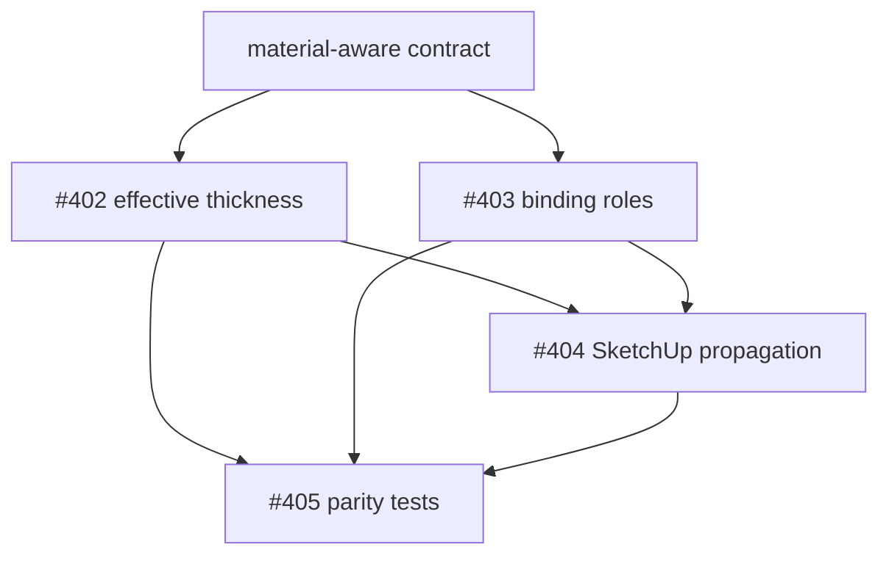

# Material-Aware Furniture Resolution

> **Estado:** CANONICAL  
> **Fecha:** 2026-08-26  
> **Bounded Contexts:** Engineering, Catalog & Libraries, Design / Proyectar 3D, SketchUp Integration, Manufacturing  
> **Programa:** #401 · issues #402–#405  
> **Documentos relacionados:** `smart-furniture-engine.md`, `parametric-furniture-library.md`, `domain-model.md`, `catalog-option-selector.md`, `sketchup-interaction-model.md`, `docs/sketchup-manufacturing-contract.md`, ADR-0001 y ADR-0002.  
> **Invariante central:** **para toda pieza de tablero respaldada por un `MaterialBoard` seleccionado, el espesor efectivo del material participa en la resolución paramétrica antes de calcular dimensiones, posiciones, poses, anchors o geometría 3D.**

---

## 1. Propósito

Este documento define el contrato canónico que conecta:

```text
Material choice
  -> material binding role
  -> MaterialBoard
  -> effective thickness
  -> formulas / spatial resolution
  -> resolved board
  -> hardware/features anchored to that board
  -> SketchUp/Web visualization
  -> BOM/manufacturing truth
```

El objetivo es evitar que Granete represente un mismo mueble con verdades físicas distintas según el cliente que lo consume.

El caso que originó este contrato fue directo: un mueble configurado con un tablero blanco de **16 mm** podía aparecer en SketchUp con componentes de cuerpo de **15 mm** y frentes de **18 mm**, porque el layout Go utilizaba el espesor nominal del `Component` para generar geometría y resolvía el material seleccionado sólo después, principalmente para color/textura/metadata.

Ese comportamiento es incorrecto.

Un acabado de tablero no es únicamente una textura. En una plataforma que conecta diseño y manufactura, `MaterialBoard` contiene propiedades físicas que pueden alterar la geometría resultante. El espesor es una de ellas.

---

## 2. Autoridad y boundary

Se mantiene el principio del Smart Furniture Engine:

> **SketchUp owns authoring and interaction. Granete owns manufacturing truth.**

Por lo tanto:

- SketchUp puede permitir seleccionar un acabado;
- SketchUp puede mostrar textura, color, veta y ficha del material;
- SketchUp puede solicitar una actualización del mueble;
- SketchUp **no** decide el espesor industrial de las piezas;
- Ruby **no** debe corregir localmente una pieza de 15/18 mm mediante `pushpull`, scaling o una lectura paralela del catálogo;
- Granete resuelve el material, el espesor efectivo, las fórmulas y la composición;
- los clientes dibujan el resultado resuelto.

El mismo contrato debe gobernar TypeScript, Go, Web 3D, SketchUp y futuras integraciones.

---

## 3. Terminología canónica

### 3.1 Espesor nominal del componente

Una definición de componente rectangular puede contener un espesor de autoría, por ejemplo:

```text
Component: Left Side
geometry.thicknessMm = 18
```

Ese valor describe el espesor por defecto con el que el componente fue definido y permite preview/fallback cuando todavía no existe una elección de tablero.

No es necesariamente el espesor final de una pieza de proyecto.

### 3.2 Material seleccionado

Una `OptionChoice` de tipo board resuelve un `MaterialBoard` concreto:

```text
BODY -> mat-arauco-white-16
```

El `MaterialBoard` contiene, entre otros datos:

```text
id
code
name
thicknessMm
manufacturer
categoryId
grainDefault
preview / texture metadata
```

### 3.3 Espesor efectivo

**Effective thickness** es el espesor utilizado para resolver la pieza concreta.

Para componentes rectangulares respaldados por un `MaterialBoard`:

```text
selected active MaterialBoard.thicknessMm
  > component nominal/default thickness
  > explicit legacy fallback only when no material binding can be resolved
```

Si el material elegido mide 16 mm y el componente nominal fue creado con 18 mm:

```text
nominalThickness = 18
materialThickness = 16
effectiveThickness = 16
```

### 3.4 Physical/semantic role

Responde qué es la pieza y cómo participa en el mueble:

```text
left_side
right_side
base
top
shelf
door
drawer_front
back_panel
```

Actualmente esa semántica aparece principalmente en `placement`, slots y metadata de componente.

### 3.5 Material binding role

Responde **qué selección de material sigue esa pieza**.

El contrato actual ya dispone de ese identificador mediante `optionRole` / código de `OptionGroup`.

Ejemplos de convenciones comunes:

```text
BODY
FRONT
BACK
PLINTH
```

Granete sigue siendo abierto: esos códigos no deben convertirse en un enum global rígido de cocinas. Un taller o una familia de muebles puede definir roles adicionales cuando existe una necesidad real.

---

## 4. Physical role y material role son ortogonales

No deben confundirse.

Ejemplo correcto:

| Componente físico | Placement / función | Material binding (`optionRole`) |
|---|---|---|
| Lateral izquierdo | `left_side` | `BODY` |
| Lateral derecho | `right_side` | `BODY` |
| Piso | `base` | `BODY` |
| Techo | `top` | `BODY` |
| Entrepaño | `shelf` | `BODY` |
| Puerta | `door` | `FRONT` |
| Frente de cajón | `drawer_front` | `FRONT` |
| Fondo | `back_panel` | `BACK` |

Esto permite al usuario pensar:

```text
Cuerpo  -> Blanco 16 mm
Frentes -> Roble 18 mm
Fondo   -> Blanco 6 mm
```

sin perder la identidad constructiva individual de cada componente.

### Regla

Nunca agrupar dependencias mediante:

- nombre del componente;
- nombre comercial del material;
- color HEX;
- textura;
- fabricante;
- coincidencia visual actual.

La dependencia es explícita mediante el material binding role.

---

## 5. No crear un segundo campo sólo para renombrar `optionRole`

Mientras el modelo actual pueda expresar correctamente la relación, `optionRole` es la clave persistida del material binding.

No se debe introducir simultáneamente:

```text
optionRole = BODY
materialRole = BODY
```

sin una diferencia semántica real, porque produciría dos autoridades para la misma relación.

Si en el futuro surge una necesidad que `optionRole` no puede representar, el cambio debe entrar mediante ADR/migración explícita.

En el estado actual:

```text
Component.optionRole / Component.optionRoles[0]
        == material binding role
```

mientras `placement`/slot/semantic role continúa expresando la identidad física.

---

## 6. Algoritmo canónico de resolución

Para cada componente rectangular de tablero:

```text
1. Find Component definition
2. Determine material binding role (optionRole)
3. Resolve effective option choice
4. If choice exists:
     find MaterialBoard
     require material.active
     require material.thicknessMm > 0
     T = material.thicknessMm
   else:
     T = component nominal/default thickness
5. Build formula context using effective T
6. Evaluate length/width formulas
7. Build spatial formula context using effective T
8. Resolve default placement pose using effective T
9. Evaluate x/y/z overrides using effective T
10. Build local board dimensions using effective T
11. Resolve AABB/transform
12. Resolve hardware/features against the final host board geometry
13. Emit material identity + effective thickness + resolved geometry together
```

Pseudocódigo conceptual:

```ts
const material = resolveSelectedBoard(component.optionRole, choices, catalog);
const T = material?.thicknessMm ?? component.geometry.thicknessMm;

const geometry = resolveGeometry({
  component,
  T,
  parentDimensions,
});

return {
  ...geometry,
  materialId: material?.id,
  thicknessMm: T,
};
```

El orden es obligatorio. Resolver el material después de generar la geometría reproduce el bug que este contrato elimina.

---

## 7. Qué significa `T` en fórmulas

`T` significa **effective thickness de la pieza actual que se está resolviendo**.

No significa:

- espesor global de toda la obra;
- espesor del primer material encontrado;
- espesor fijo de 18 mm;
- espesor del BODY salvo que la pieza actual pertenezca a BODY;
- espesor de otra pieza relacionada implícitamente.

Ejemplo:

```text
BODY -> 16 mm
```

Para un lateral BODY:

```text
T = 16
x/right placement = PW - T
```

Para un piso BODY cuya fórmula fue diseñada suponiendo laterales del mismo BODY:

```text
width = PW - 2*T
      = PW - 32
```

### Dependencias de espesor entre piezas diferentes

Una fórmula que realmente necesita el espesor de **otra** pieza no debe abusar de `T` como variable global.

Ejemplo conceptual:

```text
back panel thickness = 6
but its width depends on BODY side thickness = 16
```

Si la fórmula necesita 16, usar el `T=6` del fondo sería incorrecto. Ese tipo de dependencia debe modelarse mediante relación/anchor/contexto explícito cuando el motor lo soporte, o mediante una definición constructiva donde las piezas que comparten la hipótesis de espesor estén ligadas al mismo material role.

Hasta existir una variable/referencia explícita cross-component, el autor de catálogo no debe asumir silenciosamente que `T` significa el espesor de otro role.

Este documento **no redefine `T` como global** para ocultar ese problema.

---

## 8. Dimensión exterior vs dimensiones derivadas

Cambiar el espesor del material no debe escalar el mueble completo por accidente.

Ejemplo:

```text
external width = 600
BODY = 16
```

Si el piso está entre laterales:

```text
internal/base width = 600 - 2*16 = 568
```

Al cambiar BODY a 18:

```text
external width = 600          // permanece
internal/base width = 600 - 2*18 = 564
```

Por lo tanto:

- los parámetros externos del furniture instance permanecen como intención;
- se reevalúan las piezas derivadas;
- se recalculan posiciones dependientes;
- no se aplica generic scaling al mueble.

---

## 9. Cambio de acabado = nueva resolución paramétrica

Seleccionar otro `MaterialBoard` no es una operación puramente visual cuando cambia una propiedad física relevante.

Flujo correcto:

```text
User selects FRONT = Roble 18
        ↓
materialChoices.FRONT changes
        ↓
Granete resolves complete furniture layout again
        ↓
all FRONT components receive material + effective T=18
        ↓
formulas / positions / anchors recalculate
        ↓
client rebuilds/render resolved result
```

Flujo incorrecto:

```text
User selects FRONT = Roble 18
        ↓
replace SketchUp material/texture only
        ↓
old 16 mm geometry remains
```

El segundo flujo produce una mentira industrial.

---

## 10. Propagación por rol

Si varias piezas declaran:

```text
optionRole = FRONT
```

una elección:

```text
FRONT -> material-x
```

debe aplicarse a todas esas piezas durante la resolución.

Esto incluye componentes provenientes de:

- `Structure`;
- componentes propios de `Module`;
- componentes dentro de `Agregado`;
- múltiples copias (`quantity > 1`).

Ejemplo:

```text
1 door + 3 drawer fronts
all optionRole = FRONT
```

Cambiar FRONT debe afectar las cuatro piezas. No sólo la primera coincidencia.

Roles diferentes permanecen aislados:

```text
BODY  -> white16
FRONT -> oak18
BACK  -> back6
```

Cambiar `FRONT` no modifica `BODY` ni `BACK`.

---

## 11. Herrajes y features dependientes

Un cambio de espesor puede desplazar caras físicas.

Por eso un hardware placement o feature anclado a una pieza no puede conservar coordenadas mundiales stale.

El orden correcto es:

```text
resolve board geometry
        ↓
resolve board transform/AABB
        ↓
resolve hardware/features from host board + semantic anchor
```

Ejemplos:

- jaladera sobre frente;
- bisagra ligada a puerta/lateral;
- perforación derivada de hardware;
- machining derivado de joint/relationship.

Las coordenadas derivadas nunca son autoridad superior al host semántico.

---

## 12. SketchUp: contrato de actualización

Granete for SketchUp ya sigue el patrón arquitectónico correcto: solicita un `resolved_layout` y `FurnitureBuilder` dibuja las `dimensionsMm` recibidas.

Al cambiar un material role, el comportamiento canónico es:

```text
selector / inspector
  -> update materialChoices
  -> request fresh resolved layout
  -> validate response
  -> one SketchUp operation
  -> rebuild managed furniture contents
  -> persist successful intent metadata
```

### Rebuild MVP

`clear! + rebuild` sigue siendo una estrategia válida de MVP si cumple:

- operación atómica/undoable;
- rollback seguro ante error;
- preservación del furniture `instanceRef`;
- preservación del transform exterior del grupo administrado;
- metadata sólo representa un estado que sí fue construido con éxito.

No se requiere reconciliación diferencial en #404. Diff/patch puede ser optimización futura.

### Failure safety

Un error de red, material inválido o layout 422 no debe producir:

```text
valid furniture
 -> clear entities
 -> resolution/build error
 -> empty/broken furniture
```

La resolución debe completarse antes de iniciar mutación destructiva o el operation boundary debe demostrar rollback real.

---

## 13. Persistencia de intención

La fuente persistida debe ser la intención semántica:

```text
furnitureDefinitionId
parameters
materialChoices
identity / revision context
transform / authoring state as defined by Digital Thread
```

La geometría SketchUp es una proyección derivada.

No guardar como verdad primaria:

```text
"doorThicknessWas18BecauseThatWasTheMesh"
```

Si `materialChoices.FRONT = mat-16`, el motor puede regenerar la puerta correcta usando esa intención y la revisión de definición correspondiente.

---

## 14. Scope “este mueble” y “toda la obra”

`OptionChoices` mantiene la semántica general:

```text
project defaults + furniture/item overrides = effective choices
```

### Este mueble

Una selección en scope furniture/item crea o actualiza el override de ese mueble.

### Toda la obra

Una selección de project default debe afectar muebles que **heredan** ese role y no debe sobrescribir silenciosamente overrides explícitos.

Ejemplo:

```text
Project default FRONT = White16

Cabinet A: no override       -> White16
Cabinet B: FRONT = Oak18     -> Oak18
```

Cambiar project default:

```text
FRONT = Grey16
```

produce:

```text
Cabinet A -> Grey16
Cabinet B -> Oak18
```

### Estado actual de SketchUp

La persistencia durable de “toda la obra” debe alinearse con el Project/Design Digital Thread (#384 y descendientes, especialmente binding/revision flow).

Antes de ese binding, una preferencia temporal en la sesión del webview no debe presentarse como manufacturing truth persistida.

---

## 15. Validaciones

### Material seleccionado

Cuando existe choice explícita:

- el material debe existir;
- debe estar activo;
- `thicknessMm` debe ser válido para una pieza de tablero;
- la opción debe ser compatible con el OptionGroup/role cuando el catálogo define restricciones.

Un choice explícito inválido falla loudly.

### Sin choice

Para preview/authoring donde la elección aún no fue realizada, el motor puede usar el espesor nominal del componente como fallback determinista.

Esto no autoriza fabricar una pieza required sin material. El preflight/BOM final mantiene sus reglas de completitud.

### Legacy modules

Los módulos legacy sin composición semántica pueden necesitar fallback histórico. Ese fallback debe estar identificado explícitamente como legacy y no contaminar el resolver compuesto moderno.

### Agregados

Los agregados no crean una excepción. Cada componente interno resuelve su propio material role y effective thickness.

No usar `T=18` por conveniencia cuando el componente posee una elección de material resoluble.

---

## 16. CURRENT implementation truth y drift conocido

### TypeScript [CURRENT, semántica correcta para effective thickness]

`packages/domain/src/engine/bom.ts` dispone de `getComponentThickness(...)`, que busca la choice del `optionRole` y retorna `material.thicknessMm` cuando encuentra el material.

Ese `T` entra en el contexto de geometría y fórmulas.

### Go BOM + Go layout [CURRENT desde #402 / MT-1; drift de espesor corregido]

Ambos resolvers Go consumen una única ruta canónica de espesor efectivo:
`backend-go/internal/domain/engine/effective_thickness.go`
(`resolveSelectedBoard` + `effectiveThicknessMm`), con la precedencia
`selected active MaterialBoard.thicknessMm > component nominal thickness` y
fallo loud para choice desconocido/inactivo o sin espesor válido.

- `resolve.go` (`expandComponentInstances`) resuelve `T` desde el material
  seleccionado **antes** de evaluar fórmulas length/width, y `ResolvedBoardPart`
  emite `ThicknessMm` desde el material (paridad con TS `thicknessMm`).
- `layout.go` (`expandLayoutInstances`) usa el mismo helper antes de fórmulas
  geométricas, spatial formulas, `defaultPoseForPlacement`, dimensiones del
  board, AABB y anchors de herrajes; `LayoutComponent.ThicknessMm` y el eje de
  espesor de `DimensionsMm` salen del mismo `T` efectivo. Desde #414, el
  transform local→furniture publicado (`localTransform`) se deriva del mismo
  board ya resuelto con `T` efectivo (`boardLocalPose`), y el AABB se deriva
  del transform.
- Componentes internos de agregados resuelven su propio rol de material. El
  `T: 18` del contexto del box del agregado es el fallback legacy explícito
  (el box no tiene binding de material propio; paridad con TS
  `resolveComposedModule`).
- El stack legacy (`legacyBoardStack`) usa 18 mm sólo cuando el rol no tiene
  elección; con material seleccionado usa su espesor efectivo.
- Los fixtures de paridad deliberadamente no triviales (§18) siguen siendo
  entrega de #405.

### Material binding roles [CURRENT desde #403 / MT-2]

El contrato de binding único está implementado y enforceado en las dos pilas:

- **Helper canónico**: TS `materialBindingRole` (`packages/domain/src/materialRole.ts`)
  y Go `materialBindingRole` (`backend-go/internal/domain/engine/material_role.go`).
  Normaliza `optionRoles` (trim, sin vacíos, duplicados exactos colapsados) y
  exige exactamente un rol: cero roles o varios roles distintos fallan loudly
  en `expandComponentInstances`/`expandLayoutInstances` (ambos resolvers de
  ambas pilas). Un segundo rol nunca se ignora en silencio.
- **Autoría**: `validateComponent` (TS) y `ValidateComponent` (Go, conectado a
  `POST/PUT /api/catalog/components` con 400) rechazan bindings vacíos o
  ambiguos al guardar; el editor web usa selección exclusiva en la pestaña
  Opciones y bloquea el guardado de drafts legacy ambiguos con un aviso
  explícito.
- **Aliases legacy con precedencia idéntica TS↔Go**: direct role gana; si no,
  `ZOCLO`, `PUERTA`, `PUERTA_*` y `FRENTE_CAJON` pueden heredar la elección
  `FRENTE` (TS `resolveBoardOptionChoiceId` / Go `resolveBoardOptionChoiceID`).
  Go ya no resuelve sólo por lookup directo: `resolveSelectedBoard` y
  `ResolveMaterial` aplican la misma tabla.
- **Fixture compartido**: `contracts/materialRoleBinding.contract.json` define
  la tabla de aliases y los casos de binding; los tests de paridad
  (`packages/domain/src/materialRoleBinding.test.ts` y
  `backend-go/internal/domain/engine/regression_403_test.go`) lo consumen
  textualmente, cubriendo además los negativos: sin inferencia por
  nombre/placement, puerta normal y frentes de agregado siguiendo el mismo
  `FRONT`, y rechazo de segundo `optionRoles[]`.
- **Labels**: la UI prefiere `OptionGroup.name` (`optionRoleLabel` en
  packages/ui) para roles; el código crudo es fallback sólo cuando no existe
  grupo. La proyección SketchUp (`materialRoles[].label`) ya usaba el nombre
  del grupo cuando existe.

### SketchUp [CURRENT desde #404 / MT-3]

El inspector fusiona el role modificado con los `materialChoices` persistidos y
el provider solicita un layout completo nuevo con `choice.<role>`. Un cambio
material sin `NativeLayout` válido falla antes de abrir una operación SketchUp:
no cae al renderer genérico ni acepta un cambio paint-only.

`FurnitureBuilder` reconstruye los ComponentInstances nativos desde las
dimensiones/transforms resueltos, aísla mediante copy-on-write cualquier
definición top-level compartida accidentalmente, preserva identity/bindings y
world transform, y escribe la metadata fusionada al final de la misma operación
undoable. Un abort restaura jerarquía, definición y metadata anteriores. Ruby no
calcula espesor ni orientación y Groups legacy continúan fallando cerrado; #416
permanece fuera de este flujo.

---

## 17. Compatibilidad y migración de roles

Los catálogos actuales pueden contener roles fragmentados:

```text
LATERAL
INTERIOR
FONDO
FRENTE
```

No se deben migrar automáticamente a:

```text
BODY
BACK
FRONT
```

porque no conocemos la intención del taller.

Ejemplo: un taller puede querer laterales exteriores en acabado decorativo y piezas interiores blancas. Fusionar todo a BODY rompería esa intención.

La evolución correcta es:

1. mantener compatibilidad con roles existentes;
2. permitir que el editor de catálogo cambie explícitamente el material binding role de componentes;
3. usar OptionGroup names amigables en UI;
4. promover convenciones como BODY/FRONT/BACK/PLINTH para nuevas bibliotecas cuando representan la intención real;
5. no inferir por nombres de piezas.

Desde #403 el comportamiento alias de esos roles legacy es una tabla explícita
y única (`contracts/materialRoleBinding.contract.json`): la elección directa
del rol gana, y sólo `ZOCLO`, `PUERTA`, `PUERTA_*` y `FRENTE_CAJON` pueden
heredar la elección `FRENTE`. TS y Go consumen la misma tabla; nunca se
extiende por nombre/color/textura, y no existe migración automática de
`LATERAL`/`INTERIOR`/`FONDO`/`FRENTE` hacia BODY/BACK/FRONT: un catálogo
ambiguo exige mapping/editor explícito.

---

## 18. Paridad obligatoria TS ↔ Go ↔ SketchUp

Este bug es una clase de **semantic drift**.

La regla de `AGENTS.md` aplica especialmente aquí:

> Si una regla vive en TS y Go, planear contract fixture de paridad.

El fixture canónico de #405 debe usar espesores deliberadamente diferentes de los nominales para impedir tests falsamente verdes.

Ejemplo mínimo:

```text
nominal:
  side = 15
  base = 18
  door = 18

materials:
  white16 = 16
  oak18 = 18
  back6 = 6
```

Escenarios obligatorios:

1. BODY=16 + FRONT=16;
2. BODY=16 + FRONT=18 + BACK=6;
3. update FRONT 18→16;
4. agregado con tres drawer fronts FRONT;
5. hardware anclado a FRONT;
6. failure/rollback.

Comparar invariantes semánticos cuando TS y Go tengan representaciones diferentes (por ejemplo board-local pose vs AABB).

---

## 19. Anti-patrones prohibidos

### Paint-only material update

```text
change texture
keep old board thickness
```

Prohibido para `MaterialBoard` con propiedades físicas relevantes.

### Thickness patch in SketchUp

```ruby
if selected_material.thickness == 16
  pushpull_to_16
end
```

Prohibido. Duplica motor industrial.

### Global thickness

```text
projectThickness = 18
all formulas use 18
```

Prohibido. Un mueble puede mezclar BODY 16, FRONT 18 y BACK 6.

### Visual matching

```text
all white faces => BODY
```

Prohibido. La apariencia no define dependencia semántica.

### First-match propagation

```text
find first FRONT component and update it
```

Prohibido. El role puede tener N componentes y N copies/agregados.

### Silent legacy fallback

No permitir que un hardcoded 18 mm entre silenciosamente en un resolver moderno cuando existe material seleccionado.

---

## 20. Issue map

Programa: #401.

| Issue | Responsabilidad |
|---|---|
| #402 · MT-1 | Go layout resuelve effective thickness desde `MaterialBoard` antes de geometría |
| #403 · MT-2 | Semántica canónica de material binding roles / `optionRole` |
| #404 · MT-3 | Re-resolve + atomic rebuild en SketchUp al cambiar material role |
| #405 · MT-4 | Fixtures de regresión/paridad TS ↔ Go ↔ SketchUp |

Dependencias:



---

## 21. Definition of Done arquitectónico

El contrato se considera cumplido cuando:

- un material seleccionado de 16 mm genera piezas de 16 mm aunque el componente nominal diga 15/18;
- el effective thickness participa en fórmulas, poses y geometría antes del render;
- BODY/FRONT/BACK u otros roles actualizan todas y sólo sus piezas explícitamente ligadas;
- agregados respetan la misma regla;
- hardware/features se derivan de la geometría final del host;
- SketchUp re-resuelve y reconstruye sin calcular manufactura local;
- un fallo deja intacto el último estado válido;
- metadata conserva intención e identidad;
- TS y Go tienen fixtures de paridad con espesores no triviales;
- ninguna implementación depende de nombre/color/textura para propagar materiales;
- el scope project respeta defaults + overrides y se integra con el Digital Thread antes de declararse persistente.
