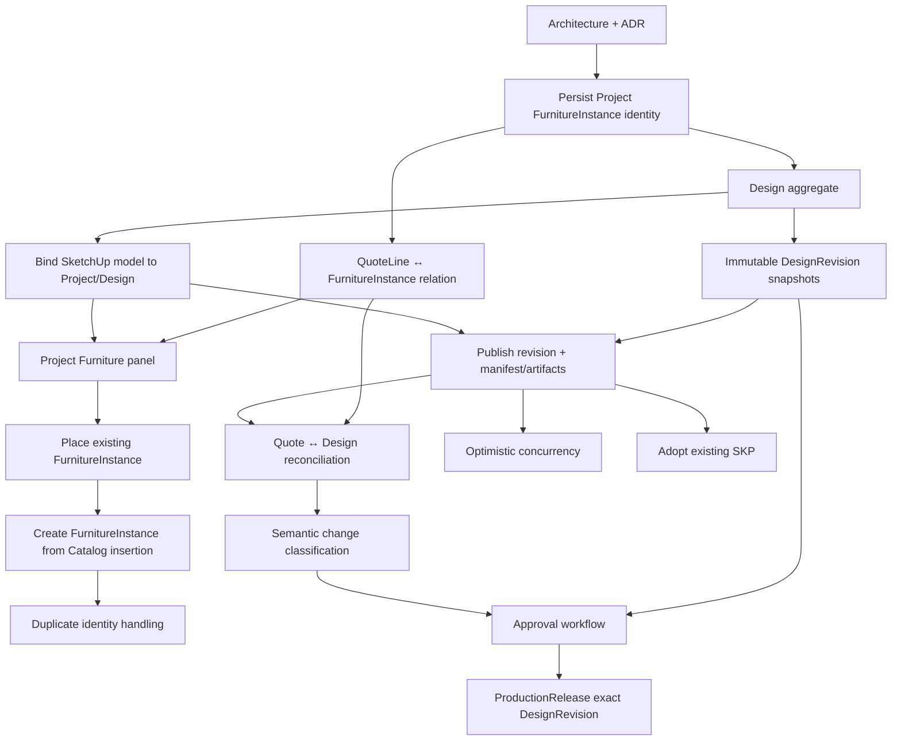

# Project Design Digital Thread

> **Estado:** CANÓNICO  
> **Fecha:** 2026-08-26  
> **ADR relacionado:** [`ADR-0003`](../adr/0003-project-owned-furniture-identity-and-versioned-design.md)  
> **Ámbito:** Sales → Projects → Design/SketchUp → Engineering → Production Release  
> **Invariante central:** **Project owns FurnitureInstance identity; quote, design and manufacturing are revisioned representations of that identity.**

---

## 1. Propósito

Este documento define el contrato arquitectónico para enlazar cotización, proyecto, diseño 3D, SketchUp y producción sin crear identidades paralelas ni depender de un archivo `.skp` como fuente de verdad empresarial.

Su objetivo es permitir de forma segura los dos flujos principales:

```text
Quote-first
Quote → Project Furniture → 3D Design → Reconciliation → Approval → Production Release

Design-first
3D Design → Project Furniture → Quote/Requote → Approval → Production Release
```

El mismo modelo debe seguir siendo válido para Proyectar 3D, SketchUp y futuros clientes 3D.

Este documento es normativo. Si un issue, PR, agente o implementación contradice una invariante aquí definida, debe cambiarse la implementación o modificarse explícitamente esta arquitectura mediante ADR; no se debe introducir una excepción local silenciosa.

---

## 2. Decisión principal

La identidad de un mueble físico pertenece al `Project` mediante `FurnitureInstance`.

```text
Project
 └── FurnitureInstance
      ├── commercial representation (QuoteRevision)
      ├── spatial/design representation (DesignRevision)
      └── manufacturing representation (resolved BOM / ProductionRelease)
```

Por tanto:

- `QuoteLine` **no** es la identidad de un mueble físico;
- `DesignRevisionItem` **no** es la identidad de un mueble físico;
- un grupo/componente de SketchUp **no** es la identidad de un mueble físico;
- `.skp` **no** es el Project;
- `Sketchup::Entity#persistent_id` **no** es un business identifier;
- `ProductionRelease` no crea una identidad distinta: libera una revisión exacta de las mismas unidades del proyecto.

La identidad empresarial estable es `FurnitureInstance.id` / `furnitureInstanceId`.

---

## 3. Invariantes obligatorias

### I1 — Project owns furniture identity

`FurnitureInstance` es una entidad de nivel Project. Debe poder existir aunque aún no tenga cotización, representación 3D o producción.

### I2 — Una unidad física, una identidad

Cada mueble físico que pueda diferir en posición, dimensiones, configuración o fabricación debe tener un `FurnitureInstance.id` distinto.

Una línea comercial con `quantity = 3` puede representar tres instancias físicas:

```text
QuoteLine QL-001 — Base Cabinet — qty 3
 ├── FurnitureInstance FI-001
 ├── FurnitureInstance FI-002
 └── FurnitureInstance FI-003
```

### I3 — QuoteRevision owns commercial truth

Una revisión de cotización describe precios, cantidades, opciones y snapshots comerciales. Una revisión aceptada no se modifica in-place.

### I4 — DesignRevision owns approved spatial/design truth

Una revisión publicada es un snapshot inmutable de la intención de diseño en un momento concreto. Cambios posteriores crean otra revisión.

### I5 — Granete owns manufacturing truth

SketchUp y Proyectar capturan intención. El dominio/backend resuelve BOM, componentes, herrajes, maquinado, validaciones y preflight.

### I6 — ProductionRelease pins exact revisions

Producción nunca consume `latest design`. Un `ProductionRelease` referencia exactamente la revisión de diseño y la revisión/fingerprint de manufactura que fueron aprobadas.

### I7 — Business identity is independent from SketchUp technical identity

`Sketchup::Entity#persistent_id` puede guardarse como locator técnico dentro de un modelo específico, pero nunca sustituye `furnitureInstanceId`.

### I8 — Copy creates identity

Copiar un mueble gestionado en SketchUp o Proyectar no puede dejar dos entidades con el mismo `furnitureInstanceId`. La copia debe recibir una nueva identidad de Project.

### I9 — Configuration changes preserve physical identity by default

Cambiar ancho, material, frente, herraje o posición no crea automáticamente un nuevo `FurnitureInstance`. Es la misma intención física evolucionando entre revisiones, salvo una acción explícita de reemplazo/split.

### I10 — Reconciliation detects; it does not silently mutate

La reconciliación compara revisiones y propone acciones. Nunca modifica silenciosamente una cotización aceptada ni una revisión de diseño publicada.

### I11 — Semantic scope controls manufacturing inclusion

Arquitectura, decoración, electrodomésticos o geometría libre pueden convivir dentro de un `.skp`. Sólo entidades semánticamente gestionadas por Granete entran al flujo productivo.

### I12 — Published revisions are immutable

Una `DesignRevision` publicada no se sobrescribe. Una nueva publicación crea una nueva revisión con `parentRevisionId`/base explícita.

### I13 — No binary-diff requirement

El versionado de `.skp` es por artefactos completos. No se requiere Git, merge binario ni delta de archivos `.skp`.

### I14 — No server-side SKP parsing as domain source

El servidor no debe necesitar abrir un `.skp` para conocer los muebles, parámetros o estado semántico de una revisión. La extensión publica un `manifest` estructurado.

---

## 4. Aggregate y relaciones canónicas

Modelo lógico:

```text
Project
├── FurnitureInstance
├── Quote
│   └── QuoteRevision
│       └── QuoteLine
│           └── QuoteLineFurnitureInstance (relation)
├── Design
│   └── DesignRevision
│       └── DesignRevisionItem
└── ProductionRelease
```

Los nombres físicos de tablas pueden adaptarse al storage actual, pero los conceptos y ownership no deben cambiar.

### No crear `ProjectFurniture`

El dominio ya define `FurnitureInstance` como una instancia real de proyecto. No introducir otra entidad con semántica equivalente (`ProjectFurniture`, `QuotedFurniture`, `SketchUpFurniture`, etc.). Si se necesita una proyección para UI, debe ser DTO/read model, no una segunda identidad.

---

## 5. FurnitureInstance

`FurnitureInstance` representa una unidad física pretendida dentro del Project.

Shape conceptual mínimo:

```ts
interface FurnitureInstance {
  id: string;
  projectId: string;
  furnitureDefinitionId?: string;

  origin: 'quote' | 'design' | 'manual' | 'import' | 'duplicate';
  originFurnitureInstanceId?: string;

  lifecycleStatus: 'active' | 'removed' | 'cancelled';

  createdAt: string;
  updatedAt: string;
}
```

### Qué NO debe contener como única verdad mutable

No usar `FurnitureInstance` como único lugar histórico para:

- precio de la cotización;
- posición aprobada;
- snapshot completo de parámetros de una revisión;
- BOM liberado;
- `productionStatus` monolítico.

Esos datos pertenecen a sus bounded contexts/revisiones.

### Estados derivados por contexto

No crear un megaestado:

```text
quoted → designed → manufacturing → assembled → installed
```

Cada contexto conserva su propio estado o lo deriva de relaciones:

- Sales: incluido/no incluido en `QuoteRevision`, accepted, pending requote;
- Design: pending placement, present, modified, removed;
- Production: released, piece execution, unit execution;
- Installation: scheduled, installed, punch, sign-off.

---

## 6. QuoteLine y materialización de unidades físicas

`QuoteLine.quantity` es una agrupación comercial; no equivale a una identidad física.

Se requiere una relación estable entre línea/revisión comercial e instancias físicas, conceptualmente:

```text
QuoteLineFurnitureInstance
- quoteRevisionId
- quoteLineId
- furnitureInstanceId
```

La implementación puede normalizar esta relación de otra manera si preserva exactamente las mismas invariantes.

### Materialization trigger

No es requisito arquitectónico que las instancias se creen en un único momento exacto. Sí es obligatorio que estén materializadas **antes de requerir trazabilidad individual**, por ejemplo antes de:

- colocar unidades distintas en un diseño;
- aceptar/liberar una cotización que debe conservar unidad física;
- generar un flujo productivo por unidad.

La función/servicio deberá ser idempotente y determinista respecto al estado comercial actual.

### Reducción de quantity

- En draft, instancias todavía no utilizadas pueden retirarse/cancelarse según reglas de dominio explícitas.
- Después de aceptación o si una instancia ya posee historia de diseño/producción, no reutilizar ni reciclar su ID.
- Cambios sobre una cotización aceptada generan nueva `QuoteRevision` (o futuro `ChangeOrder`).

### Implementación #386 (2026-09, DT-2)

La relación existe como tabla `quote_line_furniture_instances` con la
representación equivalente permitida por §4: **QuoteLine** se ancla hoy en
`project_items` (línea comercial persistida: module + quantity) y la
**aceptación** en `projects.status` (`accepted`/`produced`), sin crear un
modelo comercial paralelo. Reglas implementadas y probadas:

- `quantity=N` materializa N identidades únicas `origin='quote'` mediante un
  servicio idempotente de convergencia (advisory lock por línea); increase
  preserva identidades y agrega sólo el delta.
- Decrease en draft retira las unidades más nuevas con lifecycle terminal
  `cancelled` + unlink; las identidades nunca se borran ni se re-linkean.
  Historia durable: además de la aceptación (bloqueada), un hook explícito
  (`quoteLineInstanceDurableHistory`) es el punto de extensión donde #387+
  (DesignRevisionItem, revisiones aceptadas, producción) debe registrar
  referencias que impiden el retiro.
- Aceptada/producido es inmutable en tres capas: error tipado, policies RLS
  de INSERT/DELETE (`app_project_quote_mutable` + organización dueña) y FKs
  compuestas deferibles que hacen imposible el link cross-project y el
  borrado silencioso de una línea materializada.
- Cuando la familia revisionada de SalesQuote aterrice, añade su FK de
  revisión aquí y migra el ancla con autoridad explícita.

---

## 7. Design aggregate

`Design` representa un diseño lógico dentro de un `Project`, no un archivo SketchUp.

Ejemplos:

```text
Project PRJ-100
├── Design D-01 — Cocina principal
├── Design D-02 — Closet principal
└── Design D-03 — Cocina alternativa B
```

Shape conceptual:

```ts
interface Design {
  id: string;
  projectId: string;
  name: string;
  sourceQuoteRevisionId?: string;
  status: 'draft' | 'active' | 'archived';
  createdBy: string;
  createdAt: string;
}
```

`sourceQuoteRevisionId` expresa **provenance**: “este diseño nació desde esa revisión”. No crea ownership, no obliga igualdad permanente y no provoca cascade delete del Design si cambia la Quote.

### Client-agnostic

No nombrar la entidad `SketchUpProject` o `SketchUpDesign`. El mismo `Design` puede ser autorado por SketchUp, Proyectar 3D u otro cliente compatible.

---

## 8. DesignRevision

Una revisión publicada es un snapshot inmutable del diseño.

```ts
interface DesignRevision {
  id: string;
  designId: string;
  revisionNumber: number;
  parentRevisionId?: string;
  sourceType: 'sketchup' | 'proyectar' | 'import' | 'system';
  status: 'published' | 'approved' | 'superseded';
  createdBy: string;
  createdAt: string;
}
```

### Working copy vs published revision

La working copy puede vivir en el cliente/archivo en edición. No debe confundirse con una revisión publicada.

```text
Published R7
   ↓ open/edit
Working Copy (baseRevisionId = R7)
   ↓ publish
Published R8 (parentRevisionId = R7)
```

Nunca:

```text
Published R7 → overwrite R7
```

### Revision numbers

Los números visibles (`R1`, `R2`, ...) son secuenciales dentro de `Design`. La identidad técnica sigue siendo `designRevisionId`.

---

## 9. DesignRevisionItem

Cada revisión publicada debe indexar un snapshot semántico por mueble.

Shape conceptual:

```ts
interface DesignRevisionItem {
  designRevisionId: string;
  furnitureInstanceId: string;
  furnitureDefinitionId?: string;
  definitionVersion?: string;

  parameters: Record<string, string | number | boolean>;
  materialChoices: Record<string, string>;

  transform: {
    translationMm: [number, number, number];
    rotationDeg?: [number, number, number];
  };

  roomId?: string;

  semanticFingerprint?: string;
  commercialFingerprint?: string;
  manufacturingFingerprint?: string;
  spatialFingerprint?: string;

  clientEntityLocator?: {
    kind: 'sketchup_persistent_id' | 'proyectar_entity_id';
    value: string;
  };
}
```

Los fingerprints pueden introducirse incrementalmente; su existencia conceptual debe preservarse para evitar diseñar reconciliation alrededor de comparaciones de JSON ad hoc.

---

## 10. Artefactos de DesignRevision

Una revisión publicada puede poseer artefactos externos:

```text
projects/{projectId}/designs/{designId}/revisions/{designRevisionId}/
  model.skp
  manifest.json
  preview.webp
```

Posteriormente pueden añadirse escenas, renders, PDF u otros derivados.

### Storage rule

- Metadata relacional: DB.
- Archivos pesados/binarios: object/file storage.
- No almacenar `.skp` como blob principal dentro de PostgreSQL salvo decisión futura respaldada por ADR.

### Integrity

Guardar al menos:

- storage key;
- content type;
- size;
- SHA-256;
- SketchUp/client version cuando aplique;
- plugin/app version;
- uploader;
- timestamp.

---

## 11. Manifest contract

El cliente de autoría publica un `manifest` estructurado junto al artefacto 3D.

Ejemplo mínimo:

```json
{
  "schemaVersion": 1,
  "projectId": "PRJ-100",
  "designId": "D-01",
  "baseRevisionId": "DR-007",
  "sourceType": "sketchup",
  "items": [
    {
      "furnitureInstanceId": "FI-001",
      "furnitureDefinitionId": "kitchen-base-standard",
      "parameters": {
        "widthMm": 600,
        "heightMm": 720,
        "depthMm": 560
      },
      "materialChoices": {
        "CARCASS": "MAT-WHITE-18"
      },
      "transform": {
        "translationMm": [0, 0, 0],
        "rotationDeg": [0, 0, 0]
      }
    }
  ]
}
```

### Validation authority

El backend debe validar:

- project/design ownership;
- permisos;
- `baseRevisionId`/concurrency;
- `FurnitureInstance` pertenece al Project;
- referencias de catálogo/definition/materials;
- parámetros según contrato vigente;
- IDs duplicados;
- schema version;
- hashes/artefactos.

Un manifest válido no convierte SketchUp en manufacturing truth. El servidor/dominio sigue resolviendo el resultado industrial.

### Schema versioning

`schemaVersion` existe desde v1. Cambios incompatibles deben tener migración explícita o rechazo fail-closed.

---

## 12. Binding de modelo SketchUp

El modelo SketchUp conectado a Granete debe almacenar metadata de binding a nivel modelo:

```text
Dictionary: com.granete.project

projectId
 designId
 baseRevisionId
 schemaVersion
```

Cada mueble Nivel 1 debe conservar:

```text
Dictionary: com.granete.sketchup_extension

kind = furnitureInstance
furnitureInstanceId
furnitureDefinitionId
parameters / authoring metadata required by current contract
```

### `instanceRef` compatibility

El `instanceRef` ya usado por el contrato de SketchUp debe converger semánticamente con la identidad estable de `FurnitureInstance`. No crear dos IDs permanentes para el mismo concepto. Durante migración, si ambos campos existen, debe documentarse explícitamente cuál es alias/legacy y cuál es autoridad.

### Persistent ID

`Sketchup::Entity#persistent_id` se utiliza sólo para volver a localizar una entidad dentro de un modelo. Debe poder regenerarse/reasociarse sin cambiar `furnitureInstanceId`.

---

## 13. Project Furniture panel en SketchUp

Cuando un Design está conectado a un Project, la extensión necesita dos fuentes claramente distintas:

```text
Project Furniture
- unidades ya existentes en el Project
- quoted / pending placement / placed / modified

Catalog / Library
- FurnitureDefinition reutilizable
- al insertar crea una nueva FurnitureInstance de Project
```

Ejemplo:

```text
Proyecto: Cocina García

Pendientes de colocar (2)

FI-001 · Gabinete 1 puerta · 600 × 720 × 560
[Colocar]

FI-002 · Cajonero 3 cajones · 600 × 720 × 560
[Colocar]
```

### Place existing

`Place` materializa una `FurnitureInstance` existente. No crea otro business object.

### Insert from catalog

Con un Project conectado:

```text
FurnitureDefinition selected
        ↓
create FurnitureInstance in Project
        ↓
server returns furnitureInstanceId
        ↓
render semantic furniture in SketchUp
```

En la primera implementación connected/online, no permitir instancias productivas locales sin identidad autoritativa. Offline creation requerirá un contrato propio de IDs/sync y queda fuera del MVP.

---

## 14. Duplicate identity handling

Copiar una entidad gestionada puede duplicar también su attribute dictionary. Por tanto la extensión debe detectar duplicados de `furnitureInstanceId`.

Caso:

```text
Before:
FI-001

User copy/paste:
FI-001
FI-001   ← invalid steady state
```

Resolución esperada:

```text
FI-001
FI-009   ← new FurnitureInstance
origin = duplicate
originFurnitureInstanceId = FI-001
```

### Reglas

- nunca dejar dos muebles activos distintos con el mismo `furnitureInstanceId`;
- no usar posición o definition+dimensions como identidad;
- creación de la nueva identidad debe ser auditable;
- si falla la creación remota, el plugin debe mostrar estado explícito y bloquear publish/release de identidad ambigua.

---

## 15. Reconciliation Engine

La reconciliación compara una `QuoteRevision` y una `DesignRevision` por `furnitureInstanceId`.

Contrato conceptual inicial:

```ts
type ReconciliationStatus =
  | 'synced'
  | 'quoted_not_modeled'
  | 'modeled_not_quoted'
  | 'modified'
  | 'removed'
  | 'conflict';
```

Evolución esperada de `modified`:

```text
commercially_changed
manufacturing_changed
spatially_changed
```

### Reglas

- comparar snapshots/revisiones, no estado mutable “actual” sin revision ID;
- devolver diferencias estructuradas y accionables;
- no modificar ninguna revisión automáticamente;
- una diferencia espacial pura no debe forzar requote si no afecta verdad comercial/manufactura;
- un cambio que invalida BOM/release debe ser marcado como manufacturing change/stale;
- una instancia modelada que no está cotizada debe aparecer como pending quote;
- una instancia cotizada pero no modelada debe aparecer como pending placement.

### Fingerprints

Diseñar tres categorías, aunque se implementen gradualmente:

- `commercialFingerprint`: propiedades que afectan precio/alcance comercial;
- `manufacturingFingerprint`: resolved parts/materials/hardware/machining;
- `spatialFingerprint`: transform/room/posición y otros datos puramente espaciales.

No usar un único hash opaco para decidir todos los tipos de cambio si el usuario necesita acciones diferentes.

---

## 16. QuoteRevision después de cambios de diseño

Una `QuoteRevision` aceptada es histórica e inmutable.

```text
Accepted Quote R4
      ↓
Design changes FI-002 width 600 → 650
      ↓
Reconciliation: commercial/manufacturing change
      ↓
Create Quote R5 (or future ChangeOrder)
```

No se permite:

```text
accepted R4 → silently mutate R4
```

`ChangeOrder` queda como evolución de producto; el MVP puede utilizar una nueva `QuoteRevision` mientras preserve historial y aceptación.

---

## 17. Approval y ProductionRelease

Una revisión puede publicarse sin estar todavía aprobada.

Flujo recomendado:

```text
Working Copy
  ↓ Publish
DesignRevision R8 — published
  ↓ Reconciliation / review / authoritative preflight
DesignRevision R8 — approved
  ↓ Release
ProductionRelease PR-12
```

`ProductionRelease` debe conservar al menos:

```text
projectId
 designRevisionId
 quoteRevisionId? / commercial baseline reference
 manufacturing revision/fingerprint
 releasedBy
 releasedAt
```

### Gate mínimo

No liberar si existe cualquiera de estos blockers:

- diseño no aprobado cuando la política requiere aprobación;
- manifest/semantic identity inválido;
- authoritative manufacturing preflight blocked;
- `bomFingerprint` stale respecto al release candidate;
- reconciliation conflict comercial bloqueante;
- IDs duplicados/ambiguos.

Producción anterior permanece fijada a su revisión incluso si aparece R9/R10 posteriormente.

---

## 18. Concurrencia y publicación

No implementar colaboración tipo Google Docs para `.skp` en el MVP.

Usar optimistic concurrency:

```text
Client working copy baseRevisionId = R7
Server current revision          = R7
→ publish R8 allowed
```

Si:

```text
Client base = R7
Server current = R8
```

el servidor responde conflicto (ej. HTTP 409 / domain error `DESIGN_REVISION_CONFLICT`). Nunca overwrite silencioso.

La UI puede ofrecer:

- abrir/descargar la revisión actual;
- comparar manifests semánticos;
- publicar una variante/branch lógica futura;
- descartar/reaplicar cambios manualmente.

No intentar merge binario automático de `.skp`.

---

## 19. Adopt existing SketchUp model

No es MVP inicial, pero la arquitectura debe soportarlo.

```text
Existing .skp
   ↓ Connect to Project/Design
Scan semantic entities
   ↓
Link existing FurnitureInstance / Create new FurnitureInstance / Ignore
   ↓
Publish first managed DesignRevision
```

Matching automático sólo puede ser sugerencia. Orden recomendado:

1. existing valid `furnitureInstanceId`;
2. explicit user mapping;
3. definition/parameters similarity as suggestion only;
4. create new identity.

Nunca fusionar dos entidades automáticamente basándose sólo en geometría, nombre o posición.

---

## 20. Diseño “limpio” vs decoración

Granete no debe requerir por arquitectura dos archivos (productivo vs render) sólo para proteger BOM.

Un mismo `.skp` puede contener:

```text
Architecture
Decoration
Appliances
Managed FurnitureInstances
Annotations
```

Sólo el subgrafo semántico gestionado por Granete entra al manifest productivo/authoring contract. La geometría no gestionada no contamina BOM.

Separar archivos puede seguir siendo una recomendación de rendimiento/organización para proyectos muy grandes, pero no un requisito para corrección productiva.

---

## 21. API surface objetivo

Los paths exactos pueden adaptarse a convenciones existentes; los casos de uso no son opcionales.

### Project furniture

```http
GET  /api/projects/{projectId}/furniture-instances
POST /api/projects/{projectId}/furniture-instances
POST /api/furniture-instances/{id}/duplicate
```

### Designs

```http
GET  /api/projects/{projectId}/designs
POST /api/projects/{projectId}/designs
GET  /api/designs/{designId}
PATCH /api/designs/{designId}
```

### Revisions

```http
GET  /api/designs/{designId}/revisions
GET  /api/designs/{designId}/revisions/{revisionId}
POST /api/designs/{designId}/revisions
```

### Publish artifacts

La implementación puede comenzar con multipart al backend o usar signed upload/object storage. Debe preservar la secuencia lógica:

```text
prepare upload / validate base revision
→ upload model + manifest + preview
→ finalize revision atomically
```

Una revisión no debe quedar `published` si faltan artefactos obligatorios o falla validación.

### Reconciliation

```http
POST /api/design-reconciliation
{
  "quoteRevisionId": "...",
  "designRevisionId": "..."
}
```

### Release

```http
POST /api/projects/{projectId}/production-releases
```

---

## 22. RBAC objetivo

Introducir permisos por capacidad, integrables con factory/store/distributor scopes:

```text
design:view
 design:create
 design:edit
 design:publish
 design:approve

quote:view
 quote:edit

production:release
```

Roles concretos pueden agrupar capacidades, pero no hardcodear en la lógica de Design una lista cerrada de nombres de rol.

Acciones sensibles (`publish`, `approve`, `release`, override) deben ser auditables.

---

## 23. Audit events mínimos

El event model debe poder representar al menos:

```text
furniture_instance_created
 furniture_instance_duplicated
 furniture_instance_removed

design_created
 design_revision_published
 design_revision_approved

design_reconciliation_detected
 production_release_created
```

No es obligatorio persistir un evento por cada interacción visual. Registrar hechos de negocio, no ruido de UI.

---

## 24. Web Project UX objetivo

Pestañas conceptuales:

```text
Overview | Quote | Furniture | Design 3D | Production | Installation | Files | History
```

### Furniture digital-thread matrix

Vista objetivo:

| Furniture | Quote | Design | Production |
|---|---|---|---|
| FI-001 Base 600 | Q4 ✓ | R8 ✓ | Released |
| FI-002 Drawer | Q4 ✓ | R8 ⚠ modified | Pending |
| FI-003 Oven Tower | Missing | R8 ✓ | — |

El objetivo es mostrar continuidad del mismo objeto, no duplicar listas desconectadas.

### Design 3D workspace

Debe mostrar:

- design(s) del Project;
- current published revision;
- approval/release state;
- source quote provenance;
- reconciliation summary;
- preview;
- revision history;
- acciones `Open/Connect in SketchUp`, `Publish`, `Compare`, `Approve` según permisos.

---

## 25. Flujos canónicos

### 25.1 Quote-first

```text
1. Create Project/Quote.
2. Quote line: Base Cabinet qty 1.
3. Quote line: Drawer Unit qty 1.
4. Materialize FI-001 and FI-002.
5. Create Design from QuoteRevision.
6. Open/connect SketchUp.
7. Project Furniture lists FI-001/FI-002 pending.
8. Place both existing instances.
9. Publish DesignRevision R1.
10. Reconcile QuoteRevision vs R1.
11. Approve R1.
12. Run authoritative manufacturing preflight.
13. Create ProductionRelease pinned to R1.
```

### 25.2 Design-first

```text
1. Create Project/Design.
2. Insert FurnitureDefinition from Catalog in SketchUp.
3. Backend creates FI-010 origin=design.
4. Plugin renders FI-010 and stores its ID.
5. Publish DesignRevision.
6. Reconciliation reports modeled_not_quoted.
7. User creates/updates QuoteRevision explicitly.
8. Reconciliation becomes clean.
9. Approve/release.
```

### 25.3 Quantity > 1

```text
QuoteLine qty 3
→ FI-020, FI-021, FI-022

Design contains FI-020 and FI-021 only
→ FI-022 = quoted_not_modeled
```

### 25.4 Copy in SketchUp

```text
Copy FI-001
→ duplicate observer detects repeated business ID
→ backend creates FI-009 origin=duplicate
→ copied entity metadata rewritten to FI-009
→ original remains FI-001
```

### 25.5 Change after accepted quote

```text
Accepted Q4: FI-002 width 600
Design R3:   FI-002 width 650
→ reconciliation: changed
→ create Q5 / future ChangeOrder
→ never mutate Q4
```

### 25.6 Change after release

```text
ProductionRelease P1 → DesignRevision R3
New DesignRevision R4 published later
→ P1 still references R3
→ R4 may create a new release only after validation/approval
```

---

## 26. Anti-patterns — forbidden implementation shortcuts

1. **Do not create `SketchUpProject` as business aggregate.** Use `Design`.
2. **Do not use `QuoteLine.id` as physical furniture identity.** Quantity can be >1.
3. **Do not use SketchUp `persistent_id`, EntityID, definition name, coordinates or geometry hash as business identity.**
4. **Do not create a second entity equivalent to `FurnitureInstance`.**
5. **Do not overwrite published DesignRevision.**
6. **Do not edit accepted QuoteRevision in-place.**
7. **Do not release `latest` implicitly.** Pin an exact revision.
8. **Do not parse arbitrary SketchUp geometry server-side to infer the manufacturing model.** Publish semantic manifest.
9. **Do not calculate BOM/CNC/drilling in Ruby.** Use Granete domain/backend.
10. **Do not silently synchronize Quote ↔ Design.** Reconcile and require explicit action.
11. **Do not require a second “clean production SKP” merely to exclude decoration from BOM.** Use semantic ownership.
12. **Do not reuse deleted/cancelled FurnitureInstance IDs for replacement units.**
13. **Do not persist role-name checks throughout features.** Use permissions/capabilities.
14. **Do not introduce offline local productive IDs in the connected MVP without a documented sync protocol.**
15. **Do not mark a revision published before artifact + manifest validation completes.**

---

## 27. Implementation order / dependency graph



---

## 28. Delivery slices

### Phase 0 — Architecture

- this document;
- ADR-0003;
- canonical cross-references;
- tracking issue and child issues.

### Phase 1 — Stable project furniture identity

- persist `FurnitureInstance` independently of authoring client;
- lifecycle/origin;
- project-scoped APIs;
- tests proving IDs survive revisions and do not depend on SketchUp.

### Phase 2 — Commercial link

- QuoteLine ↔ FurnitureInstance relation;
- qty materialization;
- draft increase/decrease rules;
- accepted revision immutability;
- tests for qty > 1.

### Phase 3 — Design domain

- `Design`;
- `DesignRevision`;
- `DesignRevisionItem` snapshots;
- immutable publish semantics;
- revision history.

### Phase 4 — SketchUp Project binding

- connect model to Project/Design;
- project-level attribute dictionary;
- align `instanceRef` with `furnitureInstanceId` authority;
- project furniture query.

### Phase 5 — Project Furniture authoring

- pending/placed list;
- place existing unit;
- catalog insertion creates Project `FurnitureInstance`;
- duplicate detection/resolution.

### Phase 6 — Revision publishing

- manifest v1;
- `.skp` + preview + manifest artifacts;
- hash/integrity metadata;
- atomic finalize;
- optimistic concurrency.

### Phase 7 — Reconciliation

- QuoteRevision vs DesignRevision by FurnitureInstance;
- structured statuses;
- later commercial/manufacturing/spatial fingerprints;
- explicit requote flow.

### Phase 8 — Approval and release

- design approval;
- authoritative preflight;
- ProductionRelease pins exact DesignRevision + manufacturing fingerprint;
- post-release staleness behavior.

### Phase 9 — Advanced onboarding/concurrency

- adopt existing `.skp`;
- alternate designs;
- richer semantic diff;
- change orders;
- optional editing presence/locks.

---

## 29. Global Definition of Done

El Epic se considera funcionalmente cerrado sólo cuando este escenario es demostrable end-to-end:

1. Crear un Project.
2. Crear una cotización con `Gabinete 1 puerta ×1` y `Cajonero 3 cajones ×1`.
3. Confirmar dos `FurnitureInstance.id` distintos.
4. Crear un `Design` desde esa `QuoteRevision`.
5. Conectar/abrir el Design en SketchUp.
6. Ver ambos FurnitureInstances como pendientes.
7. Colocar ambos sin crear identidades nuevas.
8. Cambiar el ancho del cajonero.
9. Publicar `DesignRevision R1` con manifest y artefacto.
10. Ver reconciliación: gabinete sincronizado, cajonero modificado.
11. Crear una nueva `QuoteRevision` explícita para absorber el cambio comercial.
12. Reconciliar sin blockers.
13. Aprobar R1.
14. Ejecutar authoritative manufacturing preflight.
15. Crear `ProductionRelease` apuntando exactamente a R1/fingerprint.
16. Modificar el diseño y publicar R2.
17. Confirmar que el ProductionRelease anterior continúa apuntando a R1.
18. Copiar un mueble gestionado en SketchUp y confirmar que la copia obtiene un nuevo `FurnitureInstance.id`.
19. Confirmar que decoración/arquitectura no gestionada nunca aparece en BOM.
20. Confirmar que una publicación desde base stale falla sin overwrite silencioso.

---

## 30. Required test matrix

### Domain

- quantity 1 → one FurnitureInstance;
- quantity N → N unique FurnitureInstances;
- same definition/parameters can coexist with different IDs;
- configuration change preserves identity;
- duplicate creates new identity with provenance;
- accepted QuoteRevision cannot mutate;
- published DesignRevision cannot mutate;
- reconciliation status cases;
- fingerprints deterministic when implemented;
- release remains pinned after newer revision.

### Backend/API/storage

- project ownership/authz;
- idempotent materialization/duplication commands;
- no cross-project FurnitureInstance linking;
- revision numbering race-safe;
- stale base revision → conflict;
- artifact finalize atomicity;
- invalid manifest fail-closed;
- hashes persisted/verified;
- ProductionRelease requires exact revision.

### SketchUp Ruby

- model binding roundtrip;
- furniture metadata roundtrip;
- place existing preserves `furnitureInstanceId`;
- catalog insertion receives/stores server identity;
- copy/paste duplicate detected;
- duplicate failure blocks publish or clearly marks invalid state;
- non-managed geometry ignored by manifest;
- reopened `.skp` restores binding;
- `persistent_id` changes do not change business identity.

### Web UI

- Project Furniture matrix statuses;
- Design revision history;
- pending placement/pending quote states;
- explicit reconciliation actions;
- accepted quote never silently changes;
- exact released revision visible;
- permission guards.

### Integration / smoke

- canonical Quote-first scenario;
- Design-first scenario;
- qty > 1 partial placement;
- duplicate scenario;
- stale concurrent publish;
- post-release new revision does not alter active release.

---

## 31. Agent execution rules

Todo issue hijo debe:

1. leer este documento y ADR-0003 antes de implementar;
2. identificar el bounded context propietario antes de agregar estado;
3. reutilizar `FurnitureInstance` en vez de crear identidades paralelas;
4. mantener variables, tipos, funciones y APIs técnicas en inglés;
5. mantener copy de UI en español;
6. agregar tests del caso positivo y del anti-pattern que el issue evita;
7. actualizar contrato/docs si descubre una contradicción real;
8. no ampliar scope a fases dependientes sin cumplir prerequisitos;
9. ejecutar gates del repo (`pnpm test`, `pnpm typecheck`, Go/Ruby gates aplicables) según área modificada;
10. registrar en PR qué invariantes I1–I14 toca y cómo se verifican.

Si una decisión de implementación no está fijada aquí (por ejemplo signed URL vs multipart inicial), el agente puede escoger el mecanismo más simple compatible con las invariantes. No puede cambiar ownership, identidad, inmutabilidad o release semantics como “implementation detail”.

---

## 32. Canonical references

Leer junto con:

- `domain-model.md` — entidades semánticas base;
- `parametric-furniture-library.md` — `FurnitureDefinition`/`FurnitureInstance` y composición paramétrica;
- `sketchup-interaction-model.md` — autoría/interaction y jerarquía semántica dentro de SketchUp;
- `manufacturing-feature-model.md` — maquinado semántico;
- `../sketchup-manufacturing-contract.md` — intercambio autoría ↔ manufacturing;
- `../adr/0001-sketchup-authoring-muebles-manufacturing-truth.md` — ownership SketchUp/Granete;
- `../adr/0002-parametric-furniture-library-architecture.md` — librería paramétrica;
- `../adr/0003-project-owned-furniture-identity-and-versioned-design.md` — decisión de identidad/revisiones;
- `../architecture.md` — bounded contexts y contrato global de calidad.
