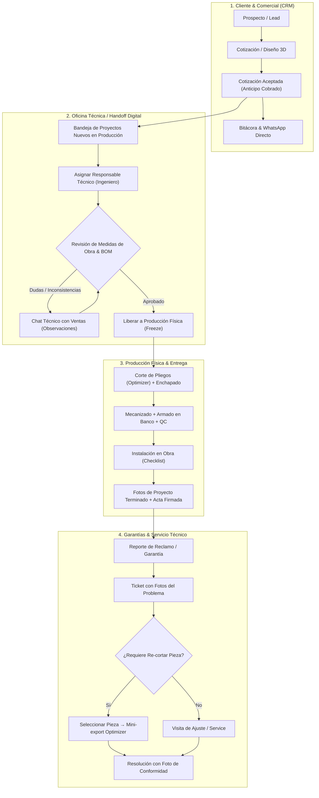

# CRM de Taller y Comunicación Interna (Ventas ↔ Ingeniería ↔ Producción ↔ Cliente)

> **Estado:** Documento de diseño / arquitectura y plan de producto  
> **Fecha:** 2026-08-15  
> **Área:** CRM, Gestión de Proyectos, Handoff Técnico, Garantías y Comunicación Interna

---

## 1. Visión y Objetivos

Este módulo formaliza y potencia dos dimensiones críticas en un taller de carpintería y mobiliario a medida:

1. **Comunicación Externa (CRM Cliente):**
   - Ficha 360° del cliente con historial de proyectos y presupuestos.
   - Bitácora de acuerdos y notas de contacto.
   - Accesos directos a WhatsApp con plantillas predefinidas.
   - Galería de fotos del proyecto: relevamiento en obra (antes), ensamble en taller (durante), fotos finales terminadas (después) y acta de entrega firmada.
   - Mesa de ayuda para tickets de garantía y servicio post-venta.

2. **Comunicación Interna y Handoff (Ventas ↔ Ingeniería ↔ Taller):**
   - **Responsabilidad Dual:** Responsable Comercial (Ventas) + Responsable Técnico (Ingeniería/Producción).
   - **División Operativa:** Pre-Producción / Oficina Técnica (Validación digital de medidas, BOM y viabilidad) vs Producción Física (Corte, enchapado y armado).
   - **Gatekeeper de Fábrica:** El responsable técnico aprueba formalmente el pase a corte o devuelve el proyecto a Ventas con observaciones.
   - **Chat Técnico Contextual:** Hilo de dudas y aclaraciones vinculado a la orden de trabajo con trazabilidad inmutable.
   - **Re-fabricación Rápida:** Generación de mini-órdenes de corte para piezas de garantía directamente al Optimizer.

---

## 2. Diagrama de Flujo Integral

---

## 3. Modelo de Datos Propuesto (PostgreSQL)

### A. Extensión a `projects`
- `assigned_engineer_id` (UUID nullable, ref `users.id`): Técnico o ingeniero a cargo de validar y producir.
- `technical_status` (VARCHAR):
  - `pending_assignment`: Esperando asignación de responsable técnico.
  - `in_review`: En validación de medidas y despiece por ingeniería.
  - `changes_requested`: Devuelto a ventas con observaciones técnicas.
  - `approved_for_production`: Aprobado; planos y BOM congelados para taller.
  - `in_workshop`: En proceso de corte / maquinado / armado.
  - `ready_to_install`: En depósito o listo para despacho.
  - `installed`: Muebles colocados en obra.
  - `completed`: Proyecto terminado con fotos finales y acta cargada.
- `survey_completed_at` (TIMESTAMP): Fecha en que se completó el relevamiento de obra.
- `installation_scheduled_date` (DATE): Fecha programada de montaje.

### B. Galería Multimedia (`project_photos`)
- `id` (UUID PK)
- `project_id` (UUID FK `projects.id` ON DELETE CASCADE)
- `stage` (VARCHAR: `survey`, `in_workshop`, `installed`, `delivery_receipt`)
- `url` (VARCHAR NOT NULL)
- `thumbnail_url` (VARCHAR NOT NULL)
- `caption` (TEXT)
- `is_showcase` (BOOLEAN DEFAULT false)
- `created_by` (UUID FK `users.id`)
- `created_at` (TIMESTAMPTZ DEFAULT CURRENT_TIMESTAMP)

### C. Mensajes y Chat Técnico Interno (`project_internal_messages`)
- `id` (UUID PK)
- `project_id` (UUID FK `projects.id` ON DELETE CASCADE)
- `sender_id` (UUID FK `users.id`)
- `message_type` (VARCHAR: `comment`, `technical_query`, `query_response`, `design_change`, `production_alert`, `gate_approval`)
- `content` (TEXT NOT NULL)
- `is_resolved` (BOOLEAN DEFAULT true)
- `attachments` (JSONB DEFAULT '[]')
- `created_at` (TIMESTAMPTZ DEFAULT CURRENT_TIMESTAMP)

### D. Tickets de Garantía y Post-Venta (`warranty_tickets` y `warranty_ticket_photos`)
- `warranty_tickets`:
  - `id` (UUID PK)
  - `code` (VARCHAR UNIQUE NOT NULL, ej. `GAR-001`)
  - `project_id` (UUID FK `projects.id`)
  - `customer_id` (UUID FK `customers.id`)
  - `title` (VARCHAR NOT NULL)
  - `description` (TEXT NOT NULL)
  - `category` (VARCHAR: `hardware_adjustment`, `damaged_part`, `finishing_defect`, `installation_issue`, `other`)
  - `priority` (VARCHAR: `low`, `normal`, `urgent` DEFAULT `normal`)
  - `status` (VARCHAR: `open`, `visit_scheduled`, `in_progress`, `resolved`, `cancelled` DEFAULT `open`)
  - `assigned_technician_id` (UUID FK `users.id`)
  - `scheduled_date` (DATE)
  - `resolved_at` (TIMESTAMPTZ)
  - `resolution_notes` (TEXT)
  - `refabrication_piece_ids` (JSONB DEFAULT '[]')
  - `created_at`, `updated_at` (TIMESTAMPTZ)
- `warranty_ticket_photos`:
  - `id` (UUID PK)
  - `ticket_id` (UUID FK `warranty_tickets.id` ON DELETE CASCADE)
  - `kind` (VARCHAR: `issue_report`, `resolution_proof`)
  - `url` (VARCHAR NOT NULL)
  - `thumbnail_url` (VARCHAR NOT NULL)
  - `created_at` (TIMESTAMPTZ)

---

## 4. Arquitectura de Almacenamiento de Archivos

1. **Compresión previa en navegador:** Canvas/WebP en cliente para reducir imágenes de 12MP a ~300KB (max 1920px).
2. **Backend Go:** 
   - Endpoint `POST /api/v1/projects/:id/photos` con soporte multipart y generación de miniaturas.
   - Almacenamiento local desacoplado en `data/uploads/projects/{projectId}/` con abstracción para S3/MinIO.

---

## 5. Fases de Implementación Propuestas

| Fase | Foco Principal | Entregables Clave |
|---|---|---|
| **Fase 1** | **Fotos + CRM Cliente + WhatsApp** | • Galería de fotos por etapas en Proyecto (Relevamiento / Taller / Instalado / Acta). • Modal visor de imágenes. • Botón rápido de WhatsApp con plantillas automáticas. • Historial 360° en Clientes. |
| **Fase 2** | **Doble Responsable & Handoff Técnico** | • Selector de Responsable Comercial e Ingeniero. • Bandeja de entrada de proyectos para validación técnica en Producción. • Chat técnico contextual por proyecto con alertas y estados de consulta. • Botones de Aprobación a Corte vs Devolución a Ventas con observaciones. |
| **Fase 3** | **Garantías & Re-fabricación** | • Módulo de Tickets de Garantía con fotos de reclamo. • Asignación de técnicos y fechas de visita. • Selección de piezas del despiece original para generar orden de re-corte al Optimizer. |
| **Fase 4** | **Showcase Comercial para Ventas** | • Catálogo visual de fotos terminadas para mostrar a nuevos prospectos filtrando por tipo de mueble y material. • Inclusión de fotos en la propuesta comercial PDF. |
