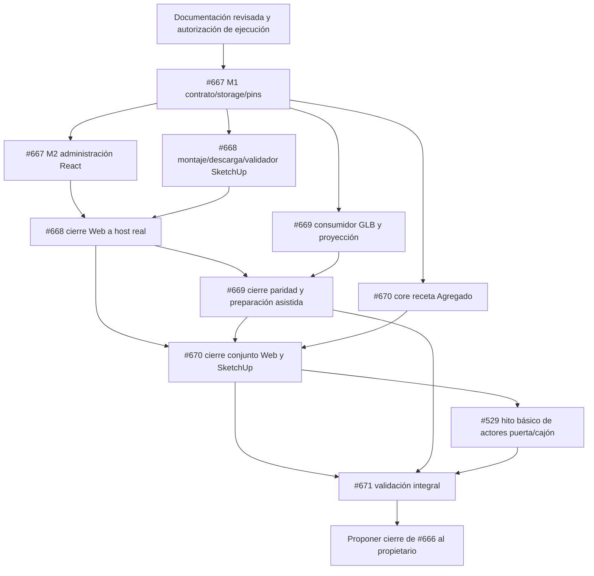

# Granete — Plan de ejecución del 3D de herrajes y conjuntos

**Estado:** planificación; ninguna implementación de este programa iniciada por este cambio.  
**Fecha:** 2026-09-11, America/Mazatlan.  
**Base inspeccionada:** `96360841187dbcc1ee4964b555eb4e88cd9e8e9d`.  
**META:** [#666](https://github.com/tiagofur/muebleria/issues/666).  
**Especificación:** [Herrajes y accesorios 3D](architecture/hardware-3d-assets-and-assemblies.md).  
**Entrada existente actualizada:** [3D Asset Library](architecture/3d-asset-library.md).

El propietario pidió documentar y crear el trabajo, no comenzar código ni fusionar cambios. Los documentos se publicaron primero en la rama `docs/hardware-3d-assets-plan-2026-09-11`; luego se crearon las issues usando los apartados del formulario `agent-work.yml`. Las etiquetas de tipo no son autorización de ejecución. El PR documental se enlaza desde #666 y no cierra las issues.

## 1. Decisión de implementación

Cinco entregas verificables y una META, no una mega-issue sin límites ni una cadena obligatoria de decenas de micro-PRs. Cada issue puede tener PRs acotados cuando el contrato lo requiera, sin crear más tickets para la misma raíz. Un único writer por defecto; pausas y dependencias se coordinan con #573.

La primera victoria visible llega al terminar #668: una jaladera real asignada desde Web aparece en SketchUp limpio. La segunda es #670: un conjunto de cajón modifica su ancho sin deformar los costados y mantiene coherencia técnica/comercial. #671 demuestra el recorrido completo del alcance, no implementa un segundo producto.

## 2. Issues creadas y entregas

| Orden | Issue | Entrega | Salida observable |
|---|---|---|---|
| 0 | [#666](https://github.com/tiagofur/muebleria/issues/666) | META de recursos y conjuntos 3D | Un mapa de estado y evidencias, no otro roadmap general |
| 1 | [#667](https://github.com/tiagofur/muebleria/issues/667) | Recursos versionados, media segura, catálogo y pins | Administrador carga/asocia desde React y ve estado real; referencias persistidas e históricas |
| 2 | [#668](https://github.com/tiagofur/muebleria/issues/668) | SKP real en SketchUp | Descarga/caché, montaje correcto, diagnóstico, undo/reapertura y R1 intacta |
| 3 | [#669](https://github.com/tiagofur/muebleria/issues/669) | GLB y proyección Web común | Mismo recurso en herraje, Agregado, mueble/estructura y Proyectar compatible |
| 4 | [#670](https://github.com/tiagofur/muebleria/issues/670) | Conjuntos rígidos y MERIVOBOX piloto | Costados separados por anclajes, variantes válidas, tableros/consumo sin duplicar |
| 5 | [#671](https://github.com/tiagofur/muebleria/issues/671) | Validación integral | V01–V14, host/WebGL real, métricas, runbook y límites demostrados |

Todas están planificadas/abiertas al registrar este documento. #667–#670 usan `type:feature`; #671 usa `type:validation`; #666 es tracker. No se asignó `status:approved`, no se alteró una feature activa y no se cerró una issue previa.

## 3. Dependencias sin ciclos



Las flechas son entregas necesarias, no permiso para varios agentes escribiendo simultáneamente. El orden operativo por defecto sigue #667 → #668 → #669 → #670 → hito #529 → #671. El core de GLB/receta puede prepararse antes sólo mediante coordinación explícita, sin saltar la evidencia de cierre.

#667 M1 admite/almacena bytes y define el protocolo de evidencias; no necesita fingir un validador SketchUp ya existente. #668 implementa su integración en el host. Hasta validación real, los recursos conservan estados pendientes/no probados. M2 de #667 no debe presentar como disponible una capacidad que todavía falta. Así no se crea el ciclo «upload exige renderer completo / renderer exige upload completo».

#529 ya tiene contrato propio. Esta coordinación no prohíbe su desarrollo básico previo ni exige que rehaga todas sus animaciones. Para el nuevo conjunto, su adaptación final consume la pertenencia fija/móvil de #670. #670 cerrado no depende de #529. #666 sí requiere el hito básico cuando se afirme presentación completa de puerta/cajón.

## 4. Reutilización y reconciliación del backlog

| Issue/autoridad existente | Decisión |
|---|---|
| #465, #308, #290 | Mantienen programa general; #666 es una rama de entregas, no reemplazo |
| #372 | Mantener cierre documental; actualizar overview con estado real, no reabrir por falta de código |
| #350, #415, #468, #498 | Reusar placement, jerarquía y runtime; no recrear edición de hardware/undo |
| #294–#297 | Reusar Agregado y sus consumidores; verificar estado/PR exactos antes de ampliar, no reiniciar por texto histórico |
| #630 | Mantener revisión canónica e identidad estable de repetidos; extender negativos a miembros del conjunto |
| #496 | Ampliar API/schema generada; no bloquear por cierre del tracker entero ni crear DTO paralelo |
| #529 | Única autoridad de apertura/cierre; añadir clarificación de miembros fijos/móviles y referencia #670 |
| #643 | Mantiene convergence Proyectar→Design/publicación; #669 no crea otra implementación ni afirma ese gate |
| #392–#395, #384 | Ampliar pins/clasificación en el lifecycle existente; no otro historial ni latest |
| #444, #644, #354 | Reusar harness WebGL/golden/host; #671 aporta escenarios de recursos/conjuntos, no infraestructura paralela |
| #472, #312, #473, #506, #504 | Reusar medición, matriz host, usabilidad y diagnóstico; no atribuir a #671 su cierre total |
| #460, #461, #462 | Preservar media segura/auditoría/Gate A; Gate B gobierna sharing cross-org, no reabrir foundations |

Durante la planificación se encontró una referencia histórica a `docs/agregados-subassemblies-plan.md` en issues antiguas que no se resolvió en el main inspeccionado. No tratar esa ruta como fuente disponible ni crear un reemplazo competidor: usar código actual, arquitectura de biblioteca, #529 y la especificación de este programa. Reconciliar enlaces históricos cuando se toque su owner.

## 5. Reparto de responsabilidades y pruebas

| Área | Owner del cambio | Gate |
|---|---|---|
| Asset/revisión/binding, upload, RLS, auditoría, APIs y pins visuales | #667 | V01/V11/V12; contrato, TS/Go/PostgreSQL/browser |
| SKP, validación host, caché, frames, atomicidad, selección y metadata | #668 | V02/V03/V04/V10; Ruby + SketchUp real |
| Par SKP/GLB, administración de preparación y escenas actuales | #669 | V05/V12; WebGL real + host |
| Receta/variante, miembros, tableros/BOM/maquinado, pins de receta | #670 | V06/V07/V08/V10/V11; dominio/Go/Web/host |
| Apertura/cierre de presentación | #529 | V09; estado separado y actores correctos |
| Evidencia transversal, catálogo de prueba, runbook y mediciones | #671 | V01–V14; owner de defectos vuelve a su issue |

Los requisitos de seguridad, historial y rollback se prueban en cada entrega; no se posponen a #671. El gate final integra evidencia y añade ensayos de producto/performance. Las pruebas parciales pueden correrse antes, pero nunca marcan todo el programa como PASS.

## 6. Hitos de producto

### H1 — Jaladera lista para demo visual

Se alcanzó sólo con #667 y #668 integradas y el recorrido real ensayado: subir → validar/asociar → colocar mueble → ver modelo correcto. Orientación/anclaje probados y errores de recurso visibles. La instalación destino no necesita archivos preparados a mano dentro del plugin.

### H2 — Representación Web coherente

#669 demuestra que herraje, Agregado, mueble/estructura y Proyectar usan la representación/pins correctos. Un SKP sin GLB se muestra como capacidad parcial. La visualización Web no certifica que #643 ya publique un DesignRevision autoritativo.

### H3 — Conjunto paramétrico útil

#670 muestra un kit MERIVOBOX concreto con tres anchos admitidos y una entrada inválida. Costados rígidos, alturas/longitudes por variante, piezas fabricadas recalculadas y juego comercial sin multiplicar. Modelo y documentación reales con procedencia/licencia; un ejemplo sintético no sustituye esa validación.

### H4 — Presentación y operación validadas

Hito básico #529 y #671: abrir/cerrar sin mover guías fijas, copiar/deshacer/reabrir sin pérdida, R1 preservada tras R2, fallos y permisos probados, métricas y soporte declarados. Sólo entonces proponer cierre de #666 dentro de su alcance; no calificar universalmente toda la aplicación o cualquier máquina.

## 7. Decisiones fijadas y datos pendientes

**Fijado:** un catálogo y un engine; Agregado como conjunto; visual separado de fabricación; rigid sin estiramiento; variantes compradas vs piezas fabricadas; SKP/GLB separados pero verificablemente relacionados; pins históricos desde el principio; estados honestos; importación asistida explícita; no inferencia por nombres ni latest.

**Debe resolverse con evidencia en su issue:** SKU/kit y revisión técnica del piloto, derechos de distribución de modelos, hosts/OS ensayados, disponibilidad real del exportador, límites de archivo/texturas/geometría y presupuestos medidos. Estas decisiones tienen owner (#667, #668/#669, #670 y #671), no quedan como preguntas sin responsable. No inventar medidas ni contratar herramientas para evitar la comprobación.

El contrato reserva extensibilidad para accesorios/profiles; no anuncia todos como implementados. Fotorrealismo, Revit/Blender adapters, físicas, segmentación inteligente de cualquier SKP y elevadores especiales no son gates ocultos de este plan.

## 8. Primer incremento futuro recomendado

Comenzar por **#667 M1: contrato/persistencia de recursos y bindings**, después de revisión documental y autorización de ejecución. Resultado acotado: referencias/pins inmutables, protocolo de carga/validación, permisos/estados y tests de roundtrip; no Ruby renderer, MERIVOBOX ni UI completa en ese primer PR.

Antes de código, el agente debe:

1. Revalidar main, PRs, comentarios, writer y reservas de #573; no asumir libre la rama de Cotizaciones o PTX.
2. Leer #666/#667 y la especificación; inventariar Asset/media/Hardware/Design reales y los campos que ya existen.
3. Proponer cambios mínimos de contrato, persistencia/seguridad y pruebas, con exclusiones y presupuesto, para aprobación humana.
4. Implementar sólo el incremento aprobado, con generated contracts y pruebas aplicables; mantener activo el mismo owner hasta una entrega publicada/revisada.

No iniciar #668 porque el esquema esté dibujado; el milestone requerido debe estar integrado. Cada PR parcial usa una sola línea de vinculación a su issue propietaria: para M1, `Refs #667` como primera línea no vacía; el programa se menciona después como `Programa: #666`, sin una segunda línea de vinculación. El PR documental #672 conserva como único target la META #666. Sin merge, cierres, etiqueta protegida, cambio de datos reales o ejecución física automáticos.

## 9. Evidencia de esta entrega documental

Esta entrega inspecciona fuentes y crea documentación/issues; no ejecuta migraciones, tests de producto, conversores, SketchUp ni máquinas. La comprobación documental y readback remoto se registran en el PR. `progress/current.md`, `feature_list.json`, código funcional y ramas activas de producto permanecen fuera del diff.

El repositorio tenía PR #664 de Cotizaciones abierto en la colección consultada. La consulta general por `is:pr` devolvió también issues, por lo que no se usó como evidencia del inventario de PRs; se consultó la colección `/pulls?state=open` directamente. Revalidar el estado al comenzar el trabajo futuro.

## 10. Gate de publicación de PRs — corrección de la preparación

`scripts/check_pr_metadata.py` exige una única referencia de vinculación en la primera línea no vacía, exactamente una etiqueta de tipo soportada en el PR y la issue vinculada abierta con una única etiqueta de estado `status:approved`. Se permiten menciones de otras issues en prosa normal, pero no un segundo target mediante palabras de vinculación, ni siquiera dentro de un bloque Markdown.

Ejemplo para el futuro PR de M1:

```text
Refs #667

Programa: #666.
Entrega: M1 de recursos 3D; no cierra la issue ni el programa.
```

Esta regla también se aplica a PRs documentales y en borrador: `type:docs` y `draft` no eximen de aprobación humana. El estado aprobado debe registrarlo el propietario sobre la issue que realmente gobierna el alcance; los agentes no se autoconceden la etiqueta ni cambian el target a una issue ajena para pasar el control. Aprobar la planificación no aprueba automáticamente las entregas hijas ni su merge.

Diagnóstico del PR #672 sobre `47896a6640c469bf14bdbbff7a02caaca2d7c981`: CI run `34654840602` terminó en success; PR Publication run `34655155781` falló en «Check current PR and approved issue». El PR tenía un único target (#666) y `type:docs`, pero #666 no tenía aprobación registrada. Este es un bloqueo de metadata, no evidencia de fallo de compilación ni motivo para modificar el workflow.

Cambiar la etiqueta de una issue no es uno de los eventos `pull_request` que escucha `.github/workflows/pr-publication.yml`. Después de registrar la aprobación humana debe reejecutarse el job fallido o producirse un evento de PR válido y comprobarse el resultado del HEAD actual. No gastar ejecuciones repitiendo el job mientras la aprobación siga ausente. Una reproducción local con etiquetas simuladas no equivale a aprobación real ni a Actions verde.
