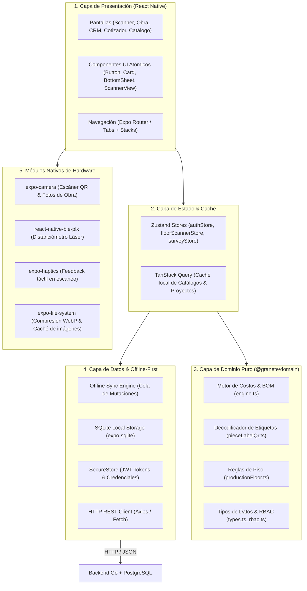
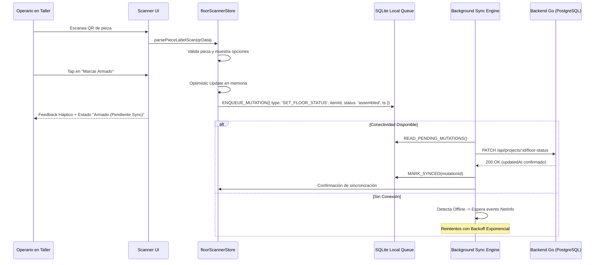

# Arquitectura Técnica — React Native (`apps/mobile`)

> **Estado:** Documento de diseño de sistemas y arquitectura técnica  
> **Fecha:** 2026-08-15  
> **Target:** `apps/mobile` en pnpm monorepo  
> **Stack:** React Native 0.76+ (New Architecture / Bridgeless), Expo SDK 52+, TypeScript 5.8+, TanStack Query, Zustand, SQLite, Go Backend REST API.

---

## 1. Topología del Monorepo y Boundaries

El monorepo `muebles` integra la aplicación móvil como un workspace de primer nivel en `apps/mobile`, consumiendo directamente los paquetes de lógica pura:

```
muebles/ (pnpm monorepo)
├── packages/
│   ├── domain/       ──► Lógica de negocio pura (BOM, costeo, QR parser, tipos) [100% Compartido]
│   ├── storage/      ──► Interfaces de repositorio y mappers API REST [Adaptado a Mobile]
│   ├── ui/           ──► Componentes React Web / DOM (Referencia de diseño y tokens)
│   └── excel/        ──► Generador de Plantilla_Optimizer.xlsx (Solo Web/Desktop)
├── apps/
│   ├── web/          ──► Vite + React SPA
│   ├── desktop/      ──► Electron Shell
│   └── mobile/       ──► Expo / React Native App (iOS & Android)
└── backend-go/       ──► API REST en Go + PostgreSQL
```

### 1.1 Reglas de Boundary y Dependencias

| Módulo | Puede importar | No puede importar |
|---|---|---|
| `apps/mobile` | `@granete/domain`, `@granete/storage`, `react-native`, `expo-*` | `packages/ui` (DOM/HTML), `packages/excel` (Node/fs), `electron` |
| `packages/domain` | TypeScript stdlib puro | Cualquier cosa externa (sin react, sin react-native, sin fs) |
| `packages/storage` | `domain`, fetch/axios agnóstico | React, React Native, electron |

### 1.2 Reutilización de Código (Web/Desktop ↔ React Native)

| Capa / Módulo | % Reutilización | Estrategia |
|---|---|---|
| `@granete/domain` (BOM, costeo, QR, RBAC) | 100% | Importación directa (TS puro) |
| DTOs & Mappers API (`apiMappers.ts`) | 100% | Misma función de serialización |
| Reglas RBAC (`rbac.ts`) | 100% | Misma función `hasPermission` |
| Parsers QR (`pieceLabelQr.ts`) | 100% | `parsePieceLabelScan` idéntico |
| Stores headless (Zustand) | ~85% | Misma lógica / adapters de entorno |
| Design Tokens (colores) | ~90% | Mapeo CSS Variables → TS Obj |
| Componentes UI visuales | 0% | React Native primitives nativos |

**Módulos de dominio clave en mobile:** `resolveBom`, `calcProjectTotals`, `setProjectItemFloorStatus`, `nextItemFloorStatus`, `parsePieceLabelScan`, `hasPermission`.

**Mappers API:** `mapApiProjectToDomain` / `mapDomainProjectToApi` (y equivalentses de Customer, Material, Module) se reutilizan 100% desde `@granete/storage`.

**Design tokens:** las CSS variables de `docs/design.md` se traducen a constantes TS en `apps/mobile/src/theme/colors.ts` (ej. `--color-primary: hsl(217, 91%, 60%)` → `'#2563eb'`). Iconografía: `lucide-react-native` (misma lista que `lucide-react`).

---

## 2. Configuración de Metro para pnpm Monorepo

Dado que `pnpm` utiliza un layout de enlaces simbólicos (`symlinks`), la configuración de Metro en `apps/mobile/metro.config.js` debe resolver correctamente los paquetes compartidos y prevenir duplicación de dependencias críticas (como `react` y `react-native`):

```javascript
// apps/mobile/metro.config.js
const { getDefaultConfig } = require('expo/metro-config');
const path = require('path');

const projectRoot = __dirname;
const monorepoRoot = path.resolve(projectRoot, '../..');

const config = getDefaultConfig(projectRoot);

// 1. Monitorear paquetes locales del monorepo
config.watchFolders = [
  monorepoRoot,
  path.resolve(monorepoRoot, 'packages/domain'),
  path.resolve(monorepoRoot, 'packages/storage'),
];

// 2. Permitir que Metro resuelva node_modules del root y del workspace
config.resolver.nodeModulesPaths = [
  path.resolve(projectRoot, 'node_modules'),
  path.resolve(monorepoRoot, 'node_modules'),
];

// 3. Forzar resolución única de React y React Native para evitar conflictos de hooks
config.resolver.extraNodeModules = {
  react: path.resolve(projectRoot, 'node_modules/react'),
  'react-native': path.resolve(projectRoot, 'node_modules/react-native'),
  '@granete/domain': path.resolve(monorepoRoot, 'packages/domain/src'),
  '@granete/storage': path.resolve(monorepoRoot, 'packages/storage/src'),
};

module.exports = config;
```

---

## 3. Diagrama de Capas de la App Móvil



---

## 4. Motor Offline-First y Sincronización

En carpintería y montaje en obra, los trabajadores frecuentemente operan en sótanos, galpones o sitios sin cobertura celular. La arquitectura de datos está diseñada con **soporte offline nativo**:

### 4.1 Ciclo de Vida de una Mutación Offline (ej. Cambio de Estado de Piso)



### 4.2 Esquema de Base de Datos Local SQLite (`expo-sqlite`)

```sql
-- Tabla de proyectos cacheados para trabajo offline
CREATE TABLE IF NOT EXISTS local_projects (
    id TEXT PRIMARY KEY,
    name TEXT NOT NULL,
    customer_id TEXT,
    status TEXT NOT NULL,
    technical_status TEXT,
    data_json TEXT NOT NULL, -- Serialización completa del Project DTO
    updated_at TEXT NOT NULL,
    synced_at TEXT NOT NULL
);

-- Tabla de catálogos cacheados (tableros, cantos, herrajes, módulos)
CREATE TABLE IF NOT EXISTS local_catalogs (
    entity_type TEXT NOT NULL, -- 'materials', 'edges', 'hardware', 'modules'
    id TEXT NOT NULL,
    data_json TEXT NOT NULL,
    updated_at TEXT NOT NULL,
    PRIMARY KEY (entity_type, id)
);

-- Cola de mutaciones pendientes de envío al backend Go
CREATE TABLE IF NOT EXISTS sync_mutation_queue (
    id TEXT PRIMARY KEY,
    endpoint TEXT NOT NULL,
    method TEXT NOT NULL, -- 'POST', 'PUT', 'PATCH', 'DELETE'
    payload_json TEXT NOT NULL,
    created_at TEXT NOT NULL,
    attempts INTEGER DEFAULT 0,
    last_error TEXT
);
```

### 4.3 Resolución de Conflictos y Concurrencia
- **Estados de Piso de Taller:** La función `setProjectItemFloorStatus` de `@granete/domain` actualiza únicamente el estado del ítem y el timestamp `updatedAt`. El backend Go valida que el avance sea mono-direccional (`pending` → `cut` → `edged` → `assembled` → `installed`), resolviendo mediante Last-Write-Wins con versionado semántico.
- **Edición de Medidas y Opciones:** Las decisiones de diseño complejas se reservan para la web; si ocurre un cambio en simultáneo, prevalece la versión con mayor `updatedAt` o se emite una alerta al usuario.

---

## 5. Integración de Módulos Nativos de Hardware

### 5.1 Escáner de Códigos QR de Alto Rendimiento
- **Librería:** `expo-camera` con `CameraView` nativo (SDK 52+).
- **Procesamiento:** `onBarcodeScanned` invoca directamente a `parsePieceLabelScan(data)` de `@granete/domain`.
- **Tiempo de Respuesta:** < 100 milisegundos desde el enfoque hasta el renderizado de la ficha de pieza.
- **Feedback:** Disparo instantáneo de `Haptics.notificationAsync(NotificationFeedbackType.Success)`.

### 5.2 Compresión y Procesamiento de Fotos de Obra
- **Librería:** `expo-image-manipulator` + `expo-file-system`.
- **Pipeline de Captura:**
  1. Toma de foto en alta resolución (12MP).
  2. Redimensionado en memoria a un ancho máximo de 1920px (manteniendo aspect ratio).
  3. Conversión a formato `WebP` con calidad 80% (reducción de ~4MB a ~280KB).
  4. Guardado en directorio temporal y encolado para subida en background mediante `FileSystem.uploadAsync` al endpoint `POST /api/projects/:id/photos`.

### 5.3 Conectividad Bluetooth LE con Distanciómetros Láser
- **Librería:** `react-native-ble-plx`.
- **Dispositivos soportados:** Protocolo estándar Bluetooth SPP / GATT para Bosch GLM 50 C / 100 C y Leica Disto D2 / X3.
- **Flujo:** La app se suscribe a las notificaciones de la característica BLE del distanciómetro. Al presionar el botón físico de disparo láser, el valor en milímetros se parsea e inyecta directamente en el campo de texto activo.

---

## 6. Seguridad y Autenticación

1. **Almacenamiento de Tokens JWT:**
   - Se utiliza `expo-secure-store` (Keychain en iOS / EncryptedSharedPreferences en Android).
   - Los tokens nunca se guardan en `AsyncStorage` ni en memoria no protegida.
2. **Biometría (Face ID / Huella Dactilar):**
   - Integración con `expo-local-authentication` para desbloqueo rápido en taller sin necesidad de escribir contraseñas con guantes de trabajo.
3. **Cifrado en Tránsito:**
   - HTTPS estricto con TLS 1.3 hacia el backend Go.
   - Headers `Authorization: Bearer <token>` inyectados automáticamente por el interceptor del cliente API.
4. **Control de Acceso Basado en Roles (RBAC):**
   - Validación local e inmediata utilizando `hasPermission` de `@granete/domain/src/rbac.ts` para ocultar botones o pantallas según el rol del usuario (`produccion`, `vendedor`, `ingeniero`, `admin`).

---

## 7. Pipeline de Construcción y CI/CD (EAS Build)

```
Código en main (apps/mobile)
   │
   ├── pnpm typecheck (Verificación TypeScript)
   ├── vitest run (Tests unitarios con @granete/domain)
   │
   ▼
Expo Application Services (EAS)
   │
   ├── EAS Build (iOS IPA / Android AAB)
   │   ├── Dev Client (para pruebas internas con hot reload)
   │   ├── Preview / Staging (distribución vía TestFlight & Firebase App Distribution)
   │   └── Production (publicación automatizada en App Store & Google Play Store)
   │
   └── EAS Update (Over-the-Air Updates para parches urgentes de JS/TS sin re-compilar binarios)
```
